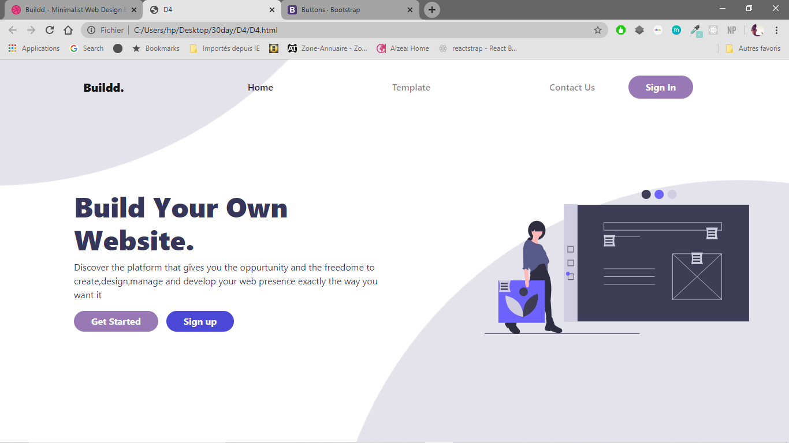
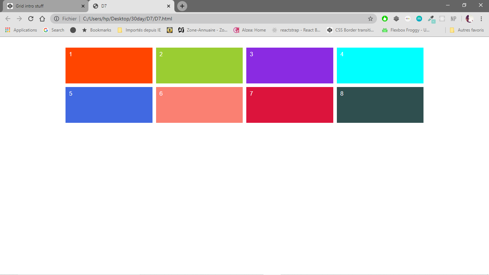
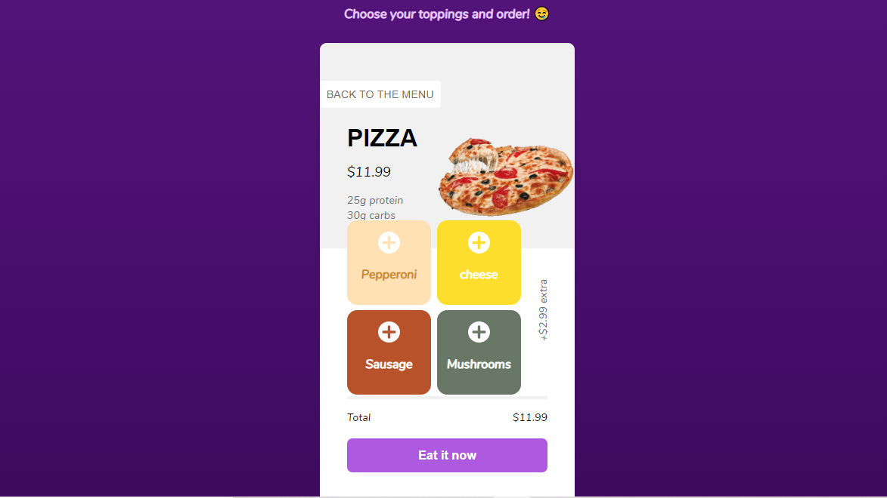

# Daily-HTML-CSS-projects
 <strong> 30 Days CSS challenge </strong>
 <ul>
 <li>DAY 1: </li>
 <li>DAY 2: </li>
 <li>DAY 3: </li>
 <li>DAY 4: <strong> Landing Page 1</strong> 
 </li>
 <li>DAY 6:<strong> Animated List</strong> </li>
 <li>DAY 7:<strong> Intro to Grids</strong>
 </li>
 <li>DAY 8:<strong> Grids and animation</strong> </li>
 <li>DAY 9:<strong> Credit Card Checkout</strong> </li>
 <li>DAY 10:<strong> Landing Page 2</strong> </li>
 <li>DAY 11:<strong> A Watermelon drawing</strong> </li>
 <li>DAY 12:<strong> The dark side of the moon</strong> </li>
 <li>DAY 13:<strong> A one div ORB</strong> </li>
 <li>DAY 14:<strong> A one div loading cercle animated</strong> </li>
 <li>DAY 15:<strong> A pizza checkout order Mobile UI</strong>
  </li>
 <li>DAY 16-17:<strong>Newspaper front page</strong> </li>
</ul>
